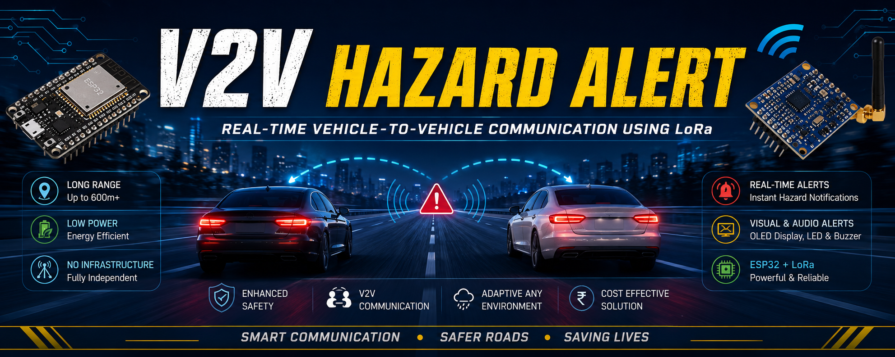
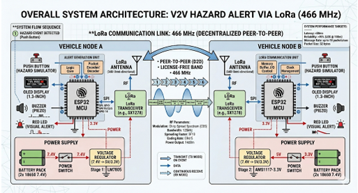
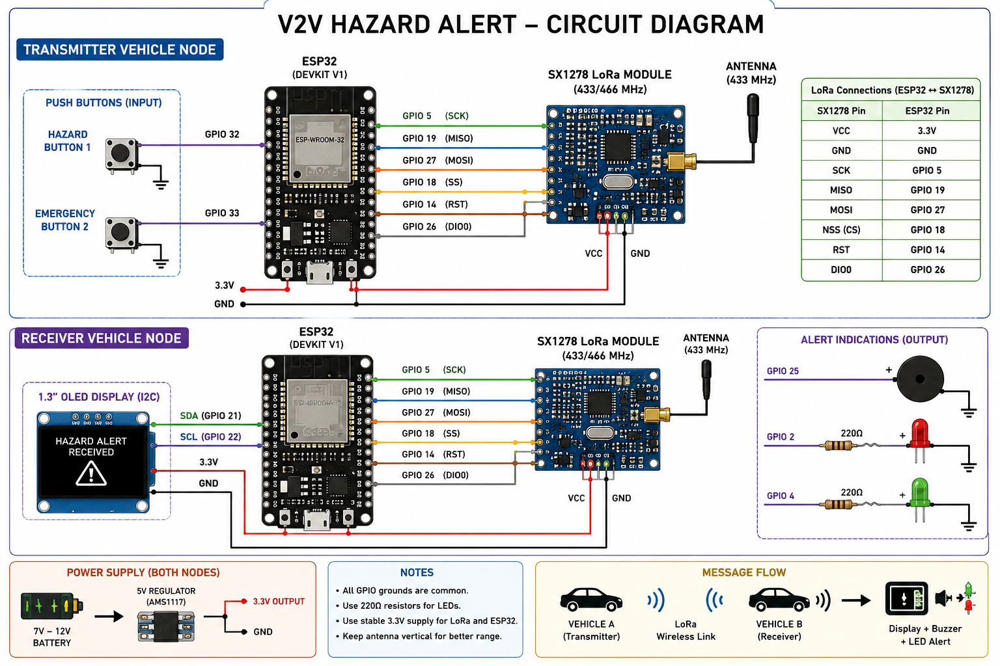

# V2V HAZARD ALERT

  

## Overview
Infrastructure-independent LoRa-based Vehicle-to-Vehicle hazard communication system using ESP32 and SX1278 for real-time hazard alert transmission and intelligent road safety applications.

V2V HAZARD ALERT is an infrastructure-independent Vehicle-to-Vehicle (V2V) communication system designed to improve road safety through real-time wireless hazard alert transmission using LoRa technology. The system leverages ESP32 microcontrollers and SX1278 LoRa modules to establish long-range, low-power peer-to-peer communication between vehicles without relying on cellular networks or roadside infrastructure.

The project enables vehicles to instantly transmit emergency warnings such as accidents, sudden braking, roadblocks, fog conditions, or hazardous situations to nearby vehicles. Upon receiving an alert, the system provides immediate audiovisual feedback through an OLED display, buzzer, and LED indicators, allowing drivers to react quickly and reduce the probability of collisions.

## Features
- Real-Time Vehicle-to-Vehicle Hazard Communication
- Infrastructure-Independent Communication
- Long-Range LoRa Wireless Transmission
- Low Power Consumption
- OLED-Based Alert Visualization
- Buzzer and LED Warning System
- Expandable Sensor Interface
- Peer-to-Peer Communication Architecture
- Lightweight Embedded System Design
- Fast Emergency Alert Transmission
- Reliable Communication in Dynamic Environments

## System Architecture

## Circuit Diagram

## Working Principle
1. **Detect hazard:** The driver presses an emergency or hazard button when a dangerous situation occurs (e.g. sudden braking, accident).
2. **Generate packet:** The ESP32 creates a lightweight data packet containing Vehicle ID, Hazard Type, and Timestamp.
3. **Transmit using LoRa:** The LoRa module transmits the emergency alert wirelessly (Spreading Factor: 12, Bandwidth: 125 kHz, Coding Rate: 4/5).
4. **Receive alert:** The receiving vehicle continuously listens for incoming LoRa packets.
5. **Display warning:** The ESP32 decodes the alert, OLED display shows warning information, LEDs glow, and the buzzer sounds.

## Results
- 600m Open Field Range
- 400–500m LOS Communication
- 300m NLOS Communication

## Future Scope
- GPS Integration
- Automatic Accident Detection
- Mobile Application
- AI-Based Hazard Detection

## Authors
Kalle Uday Bhaskar
